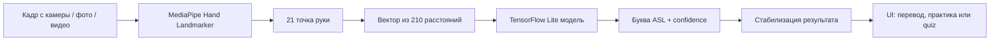

# HandTranslator — ASL Translator App

> **HandTranslator** — Android-приложение и ML-пайплайн для распознавания букв американского жестового языка (ASL), перевода текста в жестовые карточки и тренировки пользователя через интерактивные упражнения.


---

## Коротко о проекте

**HandTranslator** помогает изучать и распознавать ASL-алфавит. Проект объединяет:

- **нативное Android-приложение** на Kotlin + Jetpack Compose;
- **ML-модель TensorFlow Lite** для классификации жестов;
- **MediaPipe Hand Landmarker** для поиска ключевых точек руки;
- распознавание с **камеры**, **фотографий** и **видео**;
- режимы **перевода**, **практики** и **тестирования**;
- отдельный Python-пайплайн для подготовки датасета, обучения и экспорта модели.

Главная идея проекта — сделать изучение ASL более наглядным: пользователь может ввести английский текст и увидеть соответствующие жесты, а затем потренироваться повторять буквы перед камерой.

---

## Возможности

### Распознавание жестов в реальном времени

Приложение получает кадры с камеры через CameraX, находит руку с помощью MediaPipe, превращает 21 landmark руки в компактный вектор признаков из 210 расстояний и передаёт его в TFLite-модель.

**Что умеет live-режим:**

- распознавать ASL-буквы с камеры;
- переключаться между фронтальной и основной камерой;
- включать фонарик, если он поддерживается устройством;
- отображать landmarks поверх изображения;
- стабилизировать предсказания, чтобы уменьшить случайные ошибки.

### Распознавание фото и видео

Помимо live-камеры, приложение поддерживает выбор изображения или видео из галереи:

- для фото — распознавание жеста на выбранном изображении;
- для видео — просмотр через ExoPlayer и распознавание текущего кадра;
- отдельные пороги уверенности для фото и видео;
- настраиваемый интервал анализа видео-кадров.

### Перевод текста в ASL

Пользователь может ввести текст, а приложение покажет последовательность карточек ASL-букв. В проекте уже есть изображения для букв **A–Z**, поэтому режим подходит для быстрого визуального изучения алфавита.

### Практика после перевода

После ввода текста можно запустить тренировочную сессию: приложение показывает, какую букву нужно выполнить, а пользователь повторяет её перед камерой. Система сравнивает распознанный жест с ожидаемой буквой и ведёт прогресс.

### ASL-тесты и quiz-режим

В проекте есть отдельные обучающие сценарии:

- тест по карточкам жестов;
- сохранение лучшей серии правильных ответов;
- gesture-recognition quiz, где пользователь должен показать заданную букву камерой;
- подсчёт попыток, ошибок и результата.

### Гибкие настройки распознавания

В приложении предусмотрен экран настроек, где можно адаптировать распознавание под устройство и условия съёмки:

- cooldown между принятыми предсказаниями;
- размер sliding window;
- количество совпадений для принятия буквы;
- интервал анализа кадров;
- пороги уверенности для live/photo/video;
- режим отображения видео;
- timeout распознавания одного кадра.

---

## Как работает ML-пайплайн



### Почему 210 признаков?

MediaPipe возвращает **21 ключевую точку руки**. Для каждой пары точек считается расстояние:

```text
C(21, 2) = 21 × 20 / 2 = 210
```

Такой подход делает признак более устойчивым к положению руки в кадре: модель получает геометрию жеста, а не «сырые» координаты пикселей.

---

## Архитектура проекта

```text
ASLTranslatorApp/
├── android_app/                  # Android-приложение
│   ├── app/src/main/java/...      # Kotlin-код приложения
│   │   ├── translator/            # Главный экран, распознавание, практика
│   │   ├── test/                  # ASL-тесты и gesture quiz
│   │   ├── preferences/           # Экран настроек
│   │   ├── navigation/            # Compose Navigation routes
│   │   ├── data/preferences/      # DataStore-настройки
│   │   └── ui/theme/              # Тема приложения
│   ├── app/src/main/assets/       # labels.txt и MediaPipe task-модель
│   ├── app/src/main/ml/           # asl_model.tflite для Android ML binding
│   └── docs/                      # Архитектурная документация
│
├── PythonProject/                 # ML-часть проекта
│   ├── nnmodel.py                 # Обучение, split, экспорт TFLite
│   ├── createModel.py             # Точка запуска обучения
│   ├── getLandmarks.py            # Генерация landmark-признаков
│   ├── tests/                     # Python-тесты ML-пайплайна
│   ├── *.csv                      # Датасеты признаков
│   ├── asl_model.keras            # Keras-модель
│   └── asl_model.tflite           # Экспортированная TFLite-модель
```

---

## Основные компоненты Android-приложения

| Компонент | Назначение |
|---|---|
| `TranslatorViewModel` | Управляет состоянием главного экрана, камерой, медиа, настройками и практикой. |
| `RecognitionManager` | Объединяет детекцию landmarks и классификацию жеста. |
| `HandLandmarkerHelper` | Настраивает MediaPipe Hand Landmarker и извлекает landmarks руки. |
| `GestureRecognitionEngine` | Преобразует landmarks в признаки и получает предсказание модели. |
| `AslClassifier` | Обёртка над TFLite-моделью `asl_model.tflite`. |
| `PredictionStabilizer` | Сглаживает поток предсказаний через окно последних результатов. |
| `PracticeSessionManager` | Ведёт прогресс тренировочной сессии по введённому тексту. |
| `GestureRecognitionQuizViewModel` | Отдельный camera-based quiz для проверки жестов пользователя. |
| `DataStoreManager` | Хранит пользовательские настройки распознавания. |

---

## Технологический стек

### Android

- **Kotlin**
- **Jetpack Compose**
- **Material 3**
- **CameraX**
- **MediaPipe Tasks Vision**
- **TensorFlow Lite**
- **Android DataStore**
- **Navigation Compose**
- **Koin**
- **Media3 / ExoPlayer**
- **JUnit + AndroidX Test**

### Machine Learning / Python

- **TensorFlow / Keras**
- **TensorFlow Lite Converter**
- **MediaPipe**
- **OpenCV**
- **NumPy / Pandas**
- **scikit-learn**
- **joblib**

---

## Сильные стороны проекта

### 1. Полный end-to-end цикл

Проект не ограничивается UI: в репозитории есть и Android-клиент, и Python-инструменты для подготовки данных, обучения модели и экспорта в TFLite.

### 2. Практичная ML-интеграция

Модель работает прямо на устройстве через TensorFlow Lite. Это снижает зависимость от сервера и делает приложение более приватным: камера и распознавание остаются на стороне пользователя.

### 3. Хорошая модульность

Логика распознавания разделена на понятные слои: детекция руки, извлечение признаков, классификация, стабилизация результата и UI-сценарии. Благодаря этому отдельные части можно улучшать независимо.

### 4. Настраиваемость под реальные условия

Пороги уверенности, интервалы анализа и параметры стабилизации вынесены в настройки. Это важно для компьютерного зрения, потому что качество зависит от освещения, камеры и скорости движения руки.

### 5. Обучающий фокус

Приложение не только распознаёт жесты, но и помогает учиться: текст переводится в карточки ASL, после чего пользователь может закрепить материал в практике и quiz-режиме.

### 6. Поддержка разных источников ввода

Live-камера, фото, видео и текстовый ввод закрывают несколько сценариев использования: обучение, демонстрация, проверка готовых материалов и тренировка.

---

## Запуск Android-приложения

```bash
cd android_app
./gradlew assembleDebug
```

После сборки приложение можно открыть в Android Studio или установить debug APK на устройство/эмулятор.

> Для live-распознавания нужна камера и разрешение на её использование.

---

## Тестирование

### Android

```bash
cd android_app
./gradlew test
```

### Python

```bash
cd PythonProject
python -m pytest
```

---

## Обучение и экспорт модели

ML-часть находится в `PythonProject/`. Основная точка запуска обучения:

```bash
cd PythonProject
python createModel.py
```

Скрипт обучает Keras-модель, сохраняет encoder меток и экспортирует модель в TensorFlow Lite. Полученный `asl_model.tflite` используется Android-приложением.

---

## Что можно улучшить дальше

- добавить больше жестов и динамические слова/фразы ASL;
- расширить датасет разными пользователями, освещением и фонами;
- добавить экран статистики прогресса обучения;
- улучшить onboarding и подсказки по постановке руки;
- добавить CI для Android и Python-тестов;
- вынести метрики качества модели в отдельный отчёт;
- добавить локализацию для дополнительных языков интерфейса.

---

## Итог

**HandTranslator** — это сильный учебно-прикладной проект на стыке Android-разработки, компьютерного зрения и машинного обучения. Он демонстрирует полный путь от подготовки данных и обучения модели до мобильного приложения с реальным пользовательским сценарием: распознавать ASL, переводить текст в жесты и тренироваться до уверенного результата.
