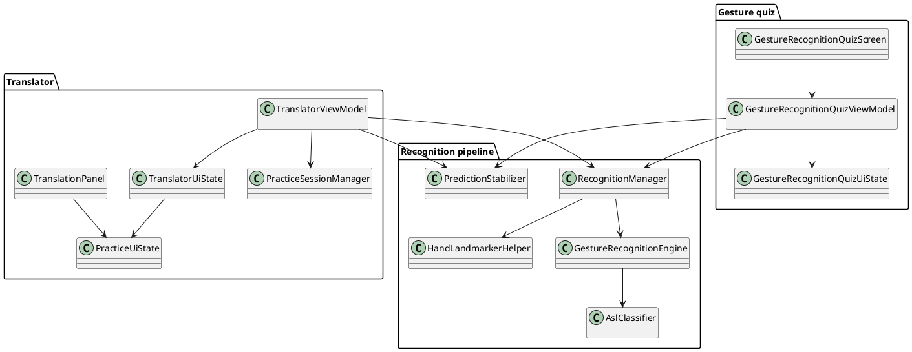
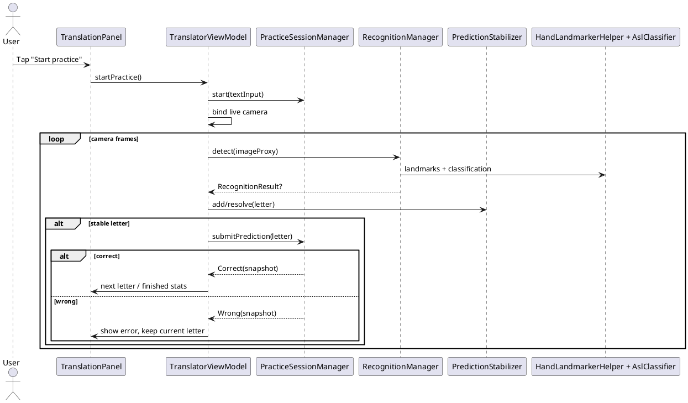
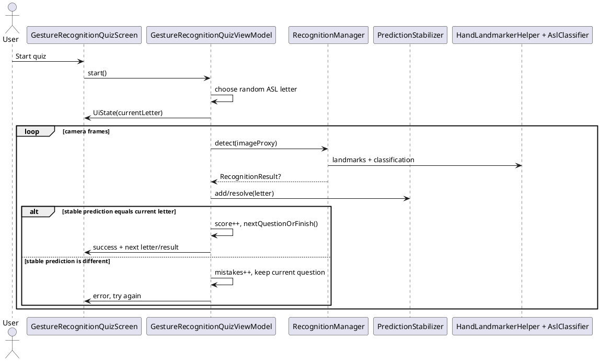

# ASL practice and gesture-recognition quiz architecture

## Feature 1: practice after text translation

`TranslatorViewModel` keeps text translation independent from practice by delegating session progress to `PracticeSessionManager`. The manager stores the normalized letter sequence, current index, error count, start/end timestamps, progress, and final statistics. The existing live-camera recognition path remains unchanged until a stabilized prediction is accepted; then `TranslatorViewModel` routes the stable letter either to translation output or to practice validation depending on `PracticeUiState.mode`.

## Feature 2: gesture-recognition quiz

`GestureRecognitionQuizViewModel` owns quiz state and CameraX binding for the new screen, but it reuses the existing `RecognitionManager`, `GestureRecognitionEngine`, `HandLandmarkerHelper`, `AslClassifier`, and `PredictionStabilizer` pipeline. A question is completed only after the stabilizer produces the requested letter. Wrong predictions increase mistake counters and keep the same question active.

## Component diagram

## Practice sequence

## Gesture-recognition quiz sequence

